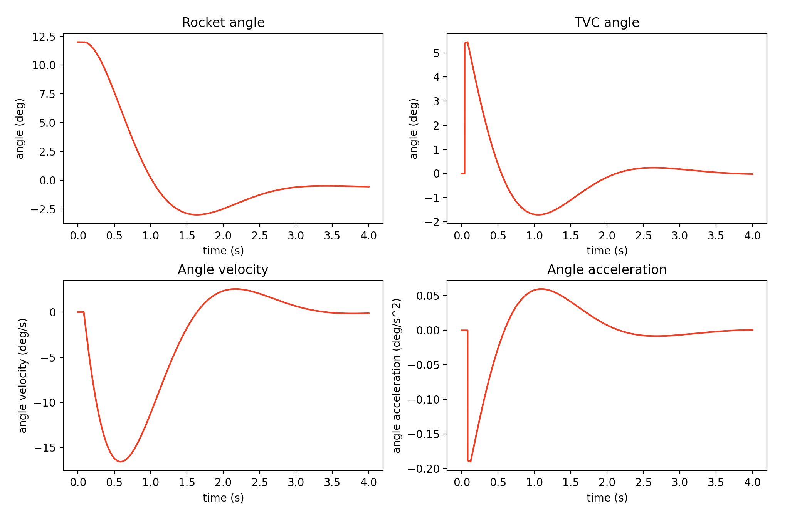

_Part of [SHKYERA](https://youtu.be/Kb4bNZGqKyE) project_

# PID Thrust Vector Control Rocket Simulator

With this software, you can tune your PID values for a thrust vector controlled rockets. It has been experimentally tested and simulator accuracy is more than enough for amateur rocketry.

## Description

The Python script simulates rocket's orientation on a purely mechanical basis (no aerodynamics 🙁). Angular momentum equations are applied to check how good a set of PID values is for a particular rocket.

## Usage

1. Find physical parameters of the rocket, that is:
   1. Mass
   2. Distance from the engine to the center of mass
   3. Mass moment of inertia ([tutorial]())
   4. Engine's thrust
   5. Delay of the actuator (time between sending a command to a physical movement of TVC mount)
2. Run the script with above parameters and find accurate PID values!

### Example usage

`python MomentumSimulator.py -delay 0.04 -moment 0.0344 -distance 0.21 -thrust 2 -mass 0.431 -length 4 -angle 12 -p 0.45 -i 0.1 -d 0.22`

As you can see, the top-left plot goes to zero pretty quickly (the rocket stabilizes), so the PID values are good a nd ready to be pasted into your controller!

### Help

Check

`python MomentumSimulator.py -h`

or post an issue.
